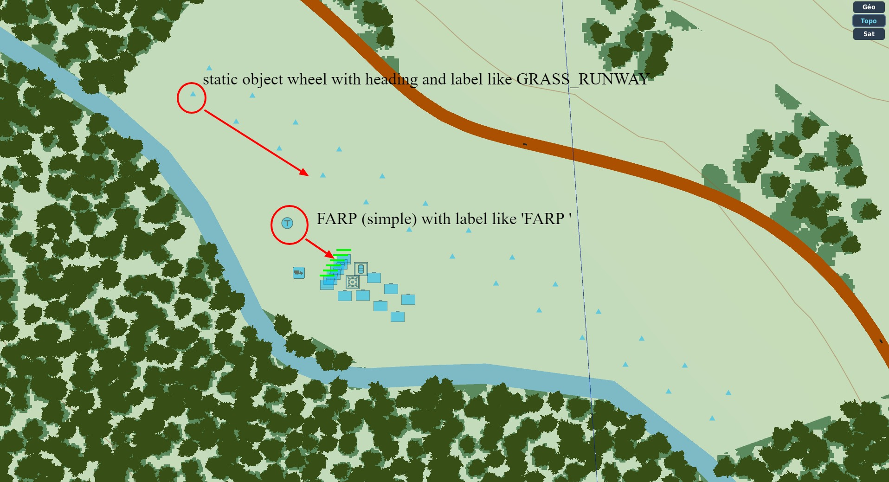
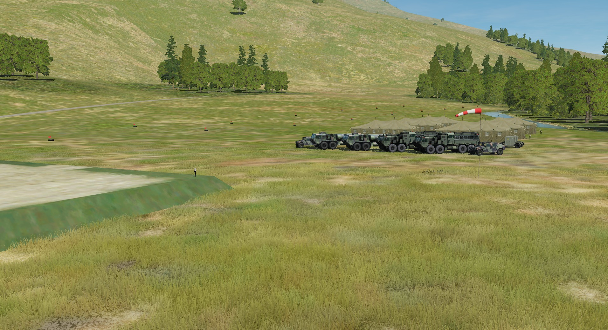
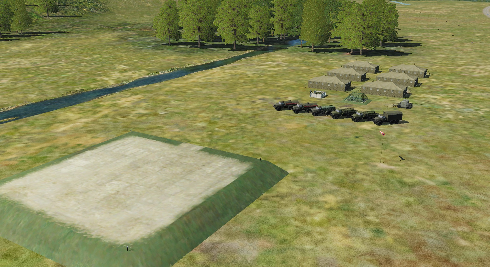

# Dynamic DCS scripts

A fully work in progress for a more Dynamic DCS World

this project is splitted into some independant libraries to be reused.

* grass.lua: a lib to crate units on FARPS and to create grass runways

## Auto build

## Auto build units on FARPS

Include grass.lua on mission start, and use "FARP " tag in group name of your FARPS

Blue side:

Red side:

## Auto build GRASS RUNWAYS

Include grass.lua on mission start, and use "GRASS_RUNWAY" tag in group name of static object (red flag + tire)

