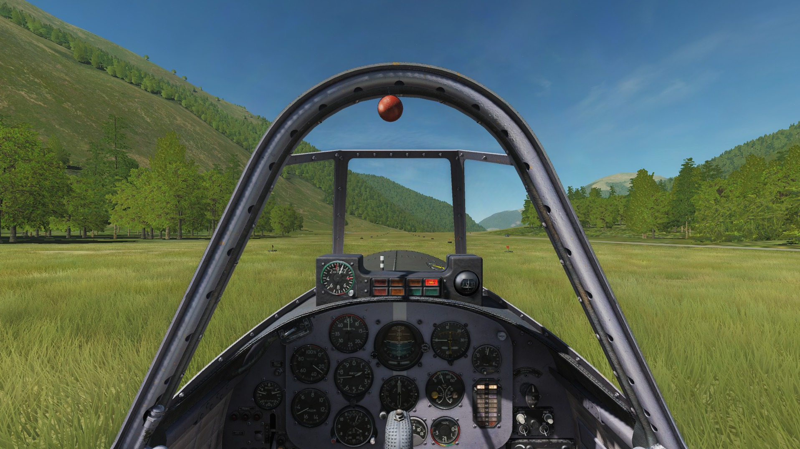

# Dynamic DCS scripts

A fully work in progress for a more Dynamic DCS World

this project use some libraries to work

* [grass.lua](doc/grass.md): a lib to create units on FARPS and to create grass runways
* [GroundTakeOff](mod/GroundTakeOff/README.md): a mod to place some aircrafts on ground



## Work on this project

```shell
git clone https://github.com/mitch10593/ddcs.git
cd ddcs
```

This project use a workflow to build and extract the Mission .miz file.

After making changes on scripts:

./build.sh

After making changes in mission editor:

./extract.sh

Never make changes on both sides (changes will be overwritten)

Mission (.miz) file will be released like executables build.